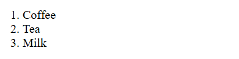

# `<ol>`

- Thẻ `<ol>` được sử dụng để tạo danh sách trong trang HTML
- Cú pháp:

```html
<ol type="...">
  <li>Coffee</li>
  <li>Tea</li>
  <li>Milk</li>
</ol> 
```
| Attribute | Value type | Ý nghĩa                                     |
| --------- | ---------- | ------------------------------------------- |
| `type`    | `string`   | Thuộc tính của thẻ ol                       |

- Thuộc tính type của thẻ <ol> xác định loại điểm đánh dấu mục danh sách:

| Type     | Description                                               |
|----------|-----------------------------------------------------------|
| type="1" | Các mục danh sách sẽ được đánh số bằng số (mặc định)      |
| type="a" | Các mục danh sách sẽ được đánh số bằng chữ in hoa         |
| type="A" | Các mục danh sách sẽ được đánh số bằng chữ thường         |
| type="i" | Các mục danh sách sẽ được đánh số bằng số La Mã in hoa    |
| type="I" | Các mục danh sách sẽ được đánh số bằng số La Mã in thường |

- Ví dụ:


